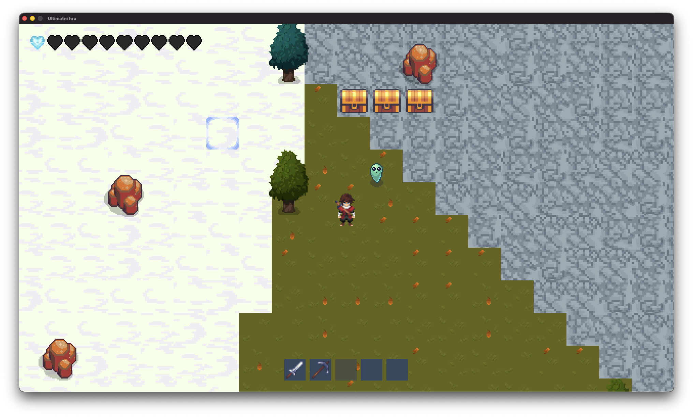

# 2D Hra - Semestrální projekt 
# 

## Dokumentace
[Plán projektu](https://github.com/user-attachments/files/23143561/Projekt.pdf)

## TODO:
1. Renderer
2. UI systém - inventář, menu, HP atd.
3. Hault execution, stopnutí procesů pokud je hráč v menu (jen v singleplayeru)
4. Zvukový engine
5. Multithreading a synchronziace proměnných různých vláken
6. Interface pro komunikaci serveru a klientu
7. Procedurální generace (perlin noise, nastavit parametry)
8. Generace struktur
9. Základní konstrukt pro Entitu (všechny další formou dědičnosti)
10. Basic path (založen na aktualní pozici entity a hráče, prostě vektor, neřešit struktury)
11. Základní AI (predfined behaviour, random cally)
12. Assety
13. Základní síťování (posílání pozic entit, základní synchronizace)

## Knihovny použité v tomto projektu:
- [RmlUI](https://github.com/mikke89/RmlUi)
- [SDL](https://github.com/libsdl-org/SDL)
- [SDL\_image](https://github.com/libsdl-org/SDL_image)
- [FreeType](https://download.savannah.gnu.org/releases/freetype/)
- [Lua-cmake-fork](https://github.com/coopeeo/lua-cmake-fork)
- [HWInfo](https://github.com/C-And-Cpp-Libraries)

## Requiremnts:
- [CMake](https://cmake.org/download/)

## Další linky:
- [Aseprite](https://www.aseprite.org/)
- [SDL tutorial web](https://glusoft.com/sdl3-tutorials/)
- [SDL tutorial playlist](https://youtube.com/playlist?list=PLvv0ScY6vfd-RZSmGbLkZvkgec6lJ0BfX&si=mb2sst8vbANOyhoHQ)
- [SDL resolution handeling](https://www.studyplan.dev/sdl2/sdl2-display-modes)
- [Basic game AI](https://gamedev.net/tutorials/programming/artificial-intelligence/the-total-beginners-guide-to-game-ai-r4942/)
- [RmlUi wiki](https://mikke89.github.io/RmlUiDoc/)
- [Assets](https://itch.io/game-assets/tag-32x32)
